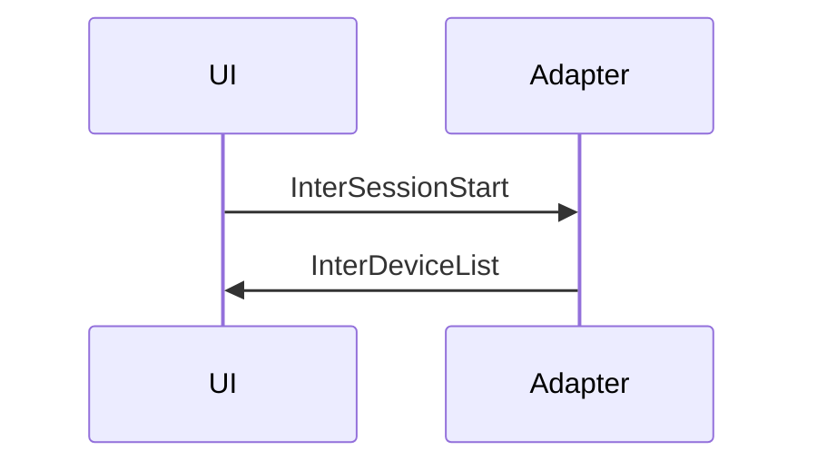
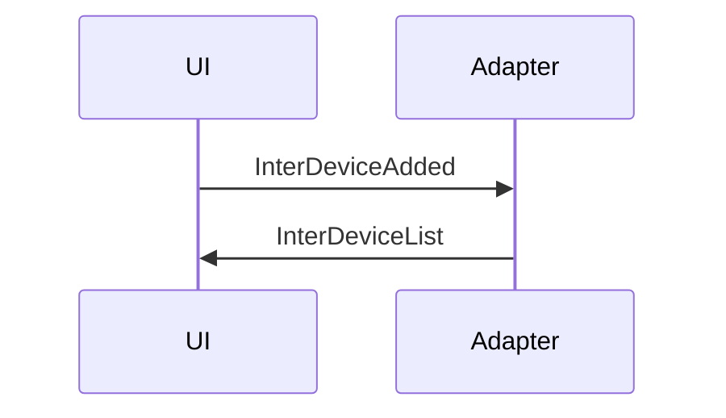
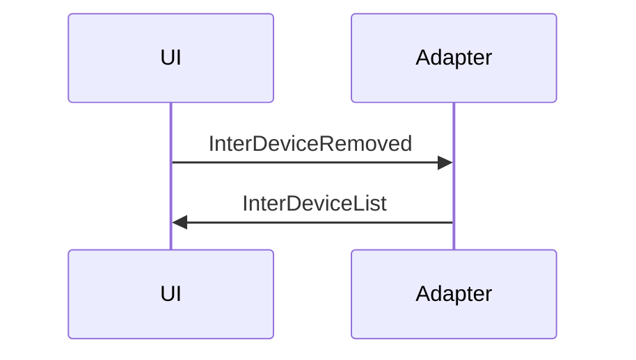
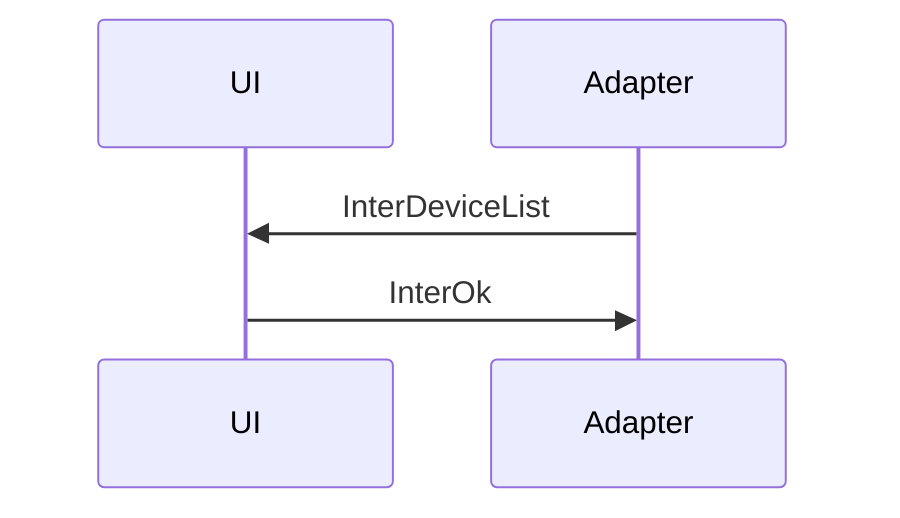

# Contributing to NoButt

## Setup Development Environment

1. Clone the repository:
    ```bash
    git clone https://github.com/butvinm/nobutt.git
    cd nobutt
    ```

2. Install prerequisites:
    * Python 3.12
    * Poetry (see [installation instructions](https://python-poetry.org/docs/#installation))
    * Npm (for building the web UI)

    Make sure you have the correct versions of the prerequisites installed:
    ```bash
    make check_prerequisites
    ```

3. Install dependencies and generate models from the protocol spec:
    ```bash
    make install
    make generate
    ```


## UI - Adapter communcation protocol

### Communication sequence

#### Start a session



#### Add a device




#### Remove a device



#### Update device state



### Messages

Just to be consist with Buttplug protocol, we will use the similar messages format.

#### InterSessionStart

```json
[
  {
    "InterSessionStart": {}
  }
]
```

#### InterDeviceAdded

```json
[
  {
    "InterDeviceAdded": {
      "Id": 0,
      "Spec": {
        "DeviceName": "Test Vibrator",
        "DeviceIndex": 0,
        "DeviceMessageTimingGap": 100,
        "DeviceDisplayName": "Rabbit Vibrator",
        "DeviceMessages": {
          "ScalarCmd": [
            {
              "StepCount": 20,
              "FeatureDescriptor": "Clitoral Stimulator",
              "ActuatorType": "Vibrate"
            },
            {
              "StepCount": 20,
              "FeatureDescriptor": "Insertable Vibrator",
              "ActuatorType": "Vibrate"
            }
          ],
          "StopDeviceCmd": {}
        }
      }
    }
  }
]
```

#### InterDeviceRemoved

```json
[
  {
    "InterDeviceRemoved": {
      "Id": 0,
      "DeviceIndex": 0
    }
  }
]
```

#### InterDeviceList

```json
[
  {
    "InterDeviceList": {
      "Id": 1,
      "Devices": [
        {
          "Spec": {
            "DeviceName": "Test Vibrator",
            "DeviceIndex": 0,
            "DeviceMessages": {
              "ScalarCmd": [
                {
                  "StepCount": 20,
                  "FeatureDescriptor": "Clitoral Stimulator",
                  "ActuatorType": "Vibrate"
                },
                {
                  "StepCount": 20,
                  "FeatureDescriptor": "Insertable Vibrator",
                  "ActuatorType": "Vibrate"
                }
              ],
              "StopDeviceCmd": {}
            }
          },
          "State": {
            "Clitoral Stimulator": {
              "Level": 0.5
            },
            "Insertable Vibrator": {
              "Level": 0.5
            }
          },
          "CmdQueue": []
        }
      ]
    }
  }
]
```

#### InterOk

```json
[
  {
    "InterOk": {
        "Id": 1
    }
  }
]
```

#### InterError

```json
[
  {
    "InterError": {
      "Id": 1,
      "ErrorMessage": "Error message"
    }
  }
]
```