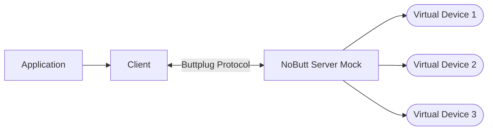

> WARNING: Work in progress. This project is in the early stages of development and may not be ready for use. It is not recommended for production use at this time.

> ANOTHER WARNING:
> I am a dummy-dumb-dumb, so this project may have the following issues (and possibly more):
> - The Buttplug protocol might be implemented incorrectly
> - A better test utility may already exist, but I am not aware of it
> - I might not fully understand certain aspects of Buttplug application development, making this project potentially useless

# NoButt

[buttplug.io](https://buttplug.io) server mock to test your applications without a physical device.

## What is NoButt?

It's recommended to read the [Buttplug Protocol Spec](https://buttplug-spec.docs.buttplug.io/) first. Here is a brief overview:

The common architecture of an application that uses the Buttplug protocol consists of the following components:
- **Application**: An application provides specific UI/UX in front of a Buttplug Client. Examples include:
    * A simple slider to control a toy from a web page
    * A 3D game
    * A typing tutor that makes the toy vibrate more as you type words correctly.
- **Client**: A library in a specific language that offers a convenient and abstracted way to access the Buttplug protocol.
- **Server**: The server that communicates with the devices and the client using the Buttplug protocol.
- **Devices**: The hardware that the server communicates with.

However, there is a problem: you need a physical device to test your application or client library. Surprisingly, there isn't a readily available mock server to test applications without a physical device (I can only assume that every developer has a buttplug at home or reimplements a server mock).

NoButt is a simple server mock that implements the Buttplug protocol. It allows you to test your application without a physical device.

Our architecture now looks like this:

NoButt communicates with the client by properly implementing the Buttplug protocol and maintaining the state of virtual devices.

This project can be useful for both application and client library developers. Some use cases include:
- Testing your application without a physical device
- Testing in CI/CD environments
- Testing against different device configurations

## How to use NoButt

NoButt server communicates via the Buttplug protocol through a websocket connection at `ws://localhost:12345`.

To manage the server and its state (add/remove devices, get device state, etc.), you can use the following methods:

#### 1. As a Python package

#### 2. Via API

#### 3. Web UI

